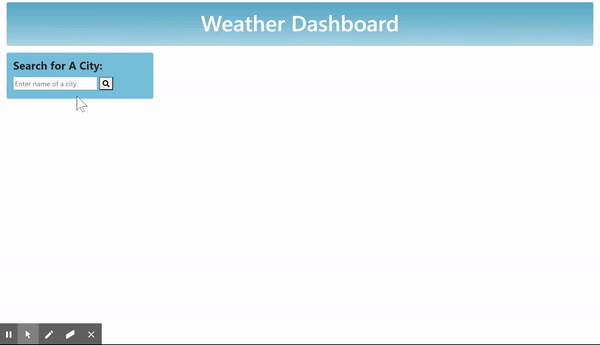

# Weather-Forecast
# Purpose
Weather Forecast is a application that provides travelers with weather condition of multiple cities in the United States up to 5 days in advance. Weather data is retrieved from openweathermap.com using API key. This application is built with visulization so that travelers can quickly obtain necessary information for their trips. 
# Tech
Weather Forecast is built with
* HTML
* CSS
* Javascript
* Jquery
* Bootstrap
* Font Awsome
* API
# Visualization 

# Deployed website
[Weather Forecast Website](https://sarah-nguyen1993.github.io/Weather-Forecast/)